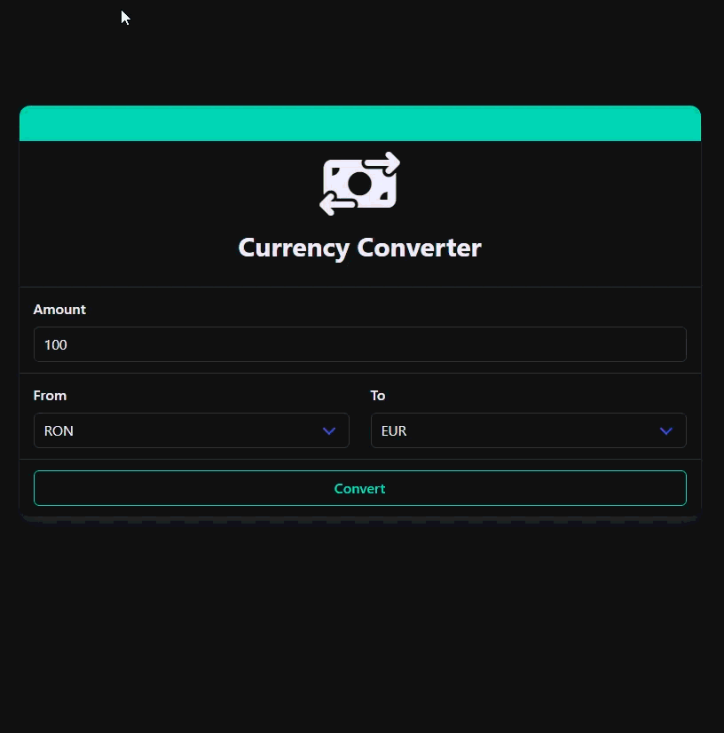

# 💱 Currency Converter

A modern, fast, and user-friendly currency converter web application built with Vue.js 3 and TypeScript. Convert between multiple currencies with real-time exchange rates.



## ✨ Features

- 🔄 **Real-time Exchange Rates** - Get the latest currency conversion rates updated regularly
- 🌍 **Multiple Currencies** - Support for a wide range of international currencies
- ⚡ **Fast & Responsive** - Built with modern web technologies for optimal performance
- 🎯 **Easy to Use** - Simple and intuitive interface for quick conversions
- 📋 **Copy to Clipboard** - Easily copy converted amounts with one click
- 🎨 **Modern UI** - Clean and beautiful design with smooth animations
- 📱 **Mobile Friendly** - Fully responsive design that works on all devices
- 🚀 **Auto-conversion** - Converts automatically as you type

## 🛠️ Technologies Used

### Core Framework

- **Vue.js 3** - Progressive JavaScript Framework
- **TypeScript** - Type-safe JavaScript
- **Vite** - Next Generation Frontend Tooling

### UI & Styling

- **Tailwind CSS** - Utility-first CSS framework
- **Buefy** - Lightweight UI components for Vue.js based on Bulma
- **Bulma** - Modern CSS framework
- **Font Awesome** - Icon library
- **Lottie** - Animation library

### Development Tools

- **Vue Router** - Official router for Vue.js
- **Pinia** - Vue.js state management
- **Axios** - HTTP client for API requests
- **Ramda** - Functional programming library
- **ESLint** - Code linting
- **Prettier** - Code formatting
- **Vitest** - Unit testing framework
- **Playwright** - E2E testing framework

## 📦 Installation

```bash
# Clone the repository
git clone https://github.com/johnrusu/vue-currency-converter.git

# Navigate to the project directory
cd vue-currency-converter

# Install dependencies
npm install
```

## 🚀 Usage

### Development

```bash
# Start development server
npm run dev
```

### Build

```bash
# Build for production
npm run build

# Preview production build
npm run preview
```

### Testing

```bash
# Run unit tests
npm run test:unit

# Run E2E tests
npm run test:e2e

# Run all tests
npm run test
```

### Code Quality

```bash
# Run linter
npm run lint

# Format code
npm run format

# Type check
npm run type-check
```

## 📝 How to Use

1. Enter the amount you want to convert
2. Select the currency you're converting from
3. Select the currency you're converting to
4. The conversion happens automatically as you type
5. Click the copy button to copy the converted amount to your clipboard

## 🌐 API

This application uses the [ExchangeRate-API](https://www.exchangerate-api.com/) to fetch real-time currency conversion rates.

## 👨‍💻 Author

**Ionut Rusu**

- Portfolio: [ionut-rusu.ro](https://ionut-rusu.ro)
- GitHub: [@johnrusu](https://github.com/johnrusu)
- LinkedIn: [ionut-rusu](https://www.linkedin.com/in/ionut-rusu-1035b112)

## 📄 License

This project is open source and available under the [MIT License](LICENSE).

## 🤝 Contributing

Contributions, issues, and feature requests are welcome! Feel free to check the [issues page](https://github.com/johnrusu/vue-currency-converter/issues).

## ⭐ Show your support

Give a ⭐️ if this project helped you!
